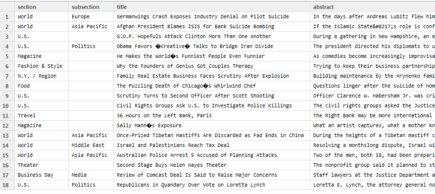

###Activity: The New York Times web site provides a rich set of APIs, as described here: http://developer.nytimes.com/docs You'll need to start by signing up for an API key.Your task is to choose one of the New York Times APIs, construct an interface in R to read in the JSON data, and transform it to an R dataframe.


__1.Objective: Get the top stories from nytimes into a data frame.__


__2.Register and get the key for the topstories API__
_API URL: http://api.nytimes.com/svc/topstories/v1/home.[response-format]?api-key={your-api-key}_

__3.Setup__

```{r}
library("httr")
library("rjson")
```

__4.Get the content__

```{r}
result <- GET("http://api.nytimes.com/svc/topstories/v1/home.json?api-key=3263f9d73ef1b9a1bd4a66174b1e832f:14:71881873")
names(result)
content <- content(result)
```

__5.Transform the content into a data frame__
```{r}
json.list <- fromJSON(content)
json.df <- as.data.frame(do.call(rbind, json.list$results))
colnames(json.df)
```

