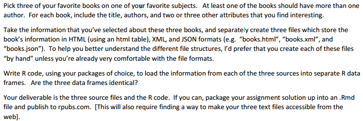

#Activity Definition:



## Setup:

```{r, results="hide"}
#Load the required libraries for data analysis.
library(RCurl)
library(XML)
library(rjson)
```

__Files__
[books.xml](https://raw.githubusercontent.com/psumank/DAMgmt/master/Assignment_9/books.xml) , 
[books.html](https://raw.githubusercontent.com/psumank/DAMgmt/master/Assignment_9/books.html) ,
[books.json](https://raw.githubusercontent.com/psumank/DAMgmt/master/Assignment_9/books.json)
```{r}
#initialize the paths to the books.xml, books.html and books.json files.
xml.url  <- "https://raw.githubusercontent.com/psumank/DAMgmt/master/Assignment_9/books.xml"
html.url <- "https://raw.githubusercontent.com/psumank/DAMgmt/master/Assignment_9/books.html"
json.url <- "https://raw.githubusercontent.com/psumank/DAMgmt/master/Assignment_9/books.json"
```


## Analysis:

__1. Read books.xml into a data frame.__

```{r, results="hide"}
#Download the "books.xml"" file into a local file.
fn <- "books_suman.xml"
if (file.exists(fn)) file.remove(fn)
download.file(url=xml.url,destfile="./books_suman.xml",method="curl")

#parse the xml
booksXml <- xmlParse(file="./books_suman.xml")

#lets prepare the data frame by joining each of the Author element from Authors node of each Book with a comma.
(dfXml <- do.call(rbind, xpathApply(booksXml, "/books/book", function(node) {
  
   Title      <- xmlValue(node[["Title"]])
   Authors    <- paste(sapply(getNodeSet(node, './Authors/Author'), function(x) { xmlValue(x) }), collapse=",")
   Publisher  <- xmlValue(node[["Publisher"]])
   ISBN       <- xmlGetAttr(node, "ISBN")
   data.frame(Title, Authors, Publisher, ISBN, stringsAsFactors = FALSE)
  
} )))
```

```{r}
#review the structure of the data frame
str(dfXml)
```


__2. Read books.html into a data frame.__

```{r, results="hide"}
#Download the "books.html"" into a local file.
fn <- "books_suman.html"
if (file.exists(fn)) file.remove(fn)
download.file(url=html.url,destfile="./books_suman.html",method="curl")

#parse the html
booksHtml <- htmlParse(file = "./books_suman.html")

#read the first HTMLTable
dfHtmlTable = readHTMLTable(doc=booksHtml, which=1, stringsAsFactors = FALSE)
```

```{r}
#review the structure of the data frame
str(dfHtmlTable)
```


__3. Read books.json into a data frame.__
```{r, results="hide"}
#Download the "books.json"" into a local file.
fn <- "books_suman.json"
if (file.exists(fn)) file.remove(fn)
download.file(url=json.url,destfile="./books_suman.json",method="curl")

#parse the json file
json_file = fromJSON(file = "./books_suman.json")

#lets prepare the data frame by joining each of the 'Authors' array elements from book document with in books colleciton with a comma.
(dfJSON <- do.call(rbind, lapply(json_file$books$book, function(node) {
  
  Title      <- node[["Title"]]
  Authors    <- paste(node[["Authors"]], collapse=",")
  Publisher  <- node[["Publisher"]]
  ISBN       <- node[["ISBN"]]
  
  data.frame(Title, Authors, Publisher, ISBN, stringsAsFactors = FALSE)
  
} )))
```

```{r}
#review the structure of the data frame
str(dfJSON)
```


__4. Lets make sure all of the above 3 data frames prepared from xml, html and json are all identical.__
```{r}
identical(dfXml,dfHtmlTable)
identical(dfXml,dfJSON)
```


